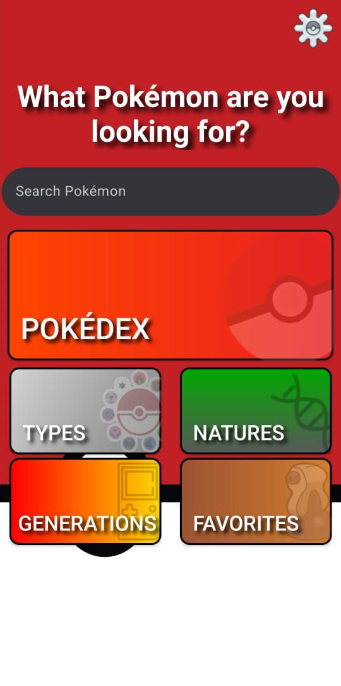
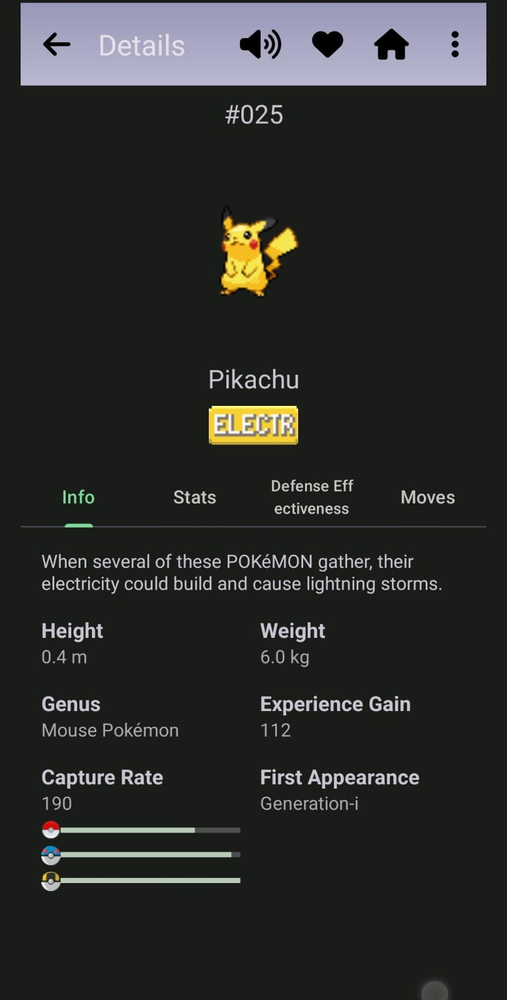
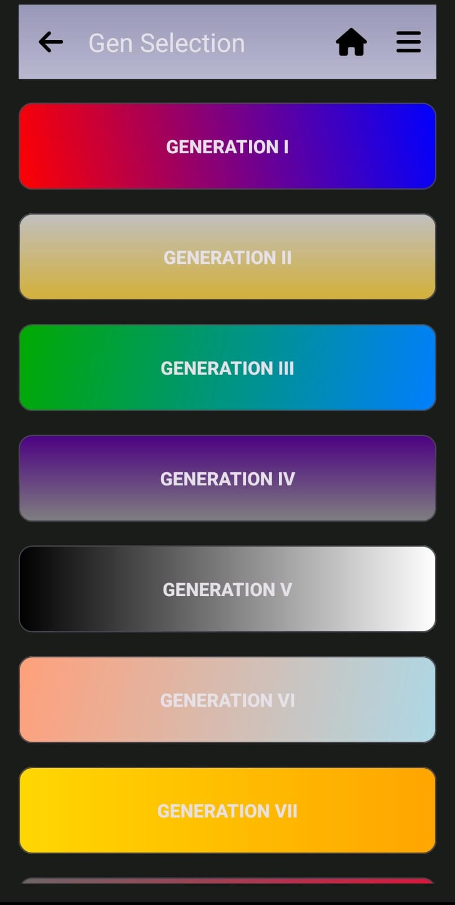
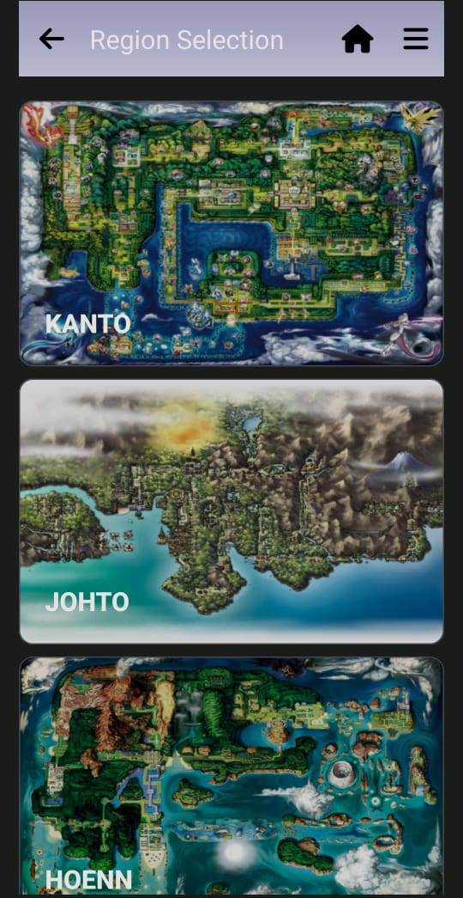
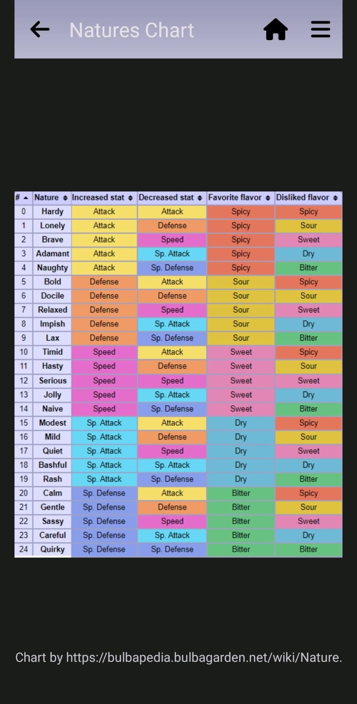
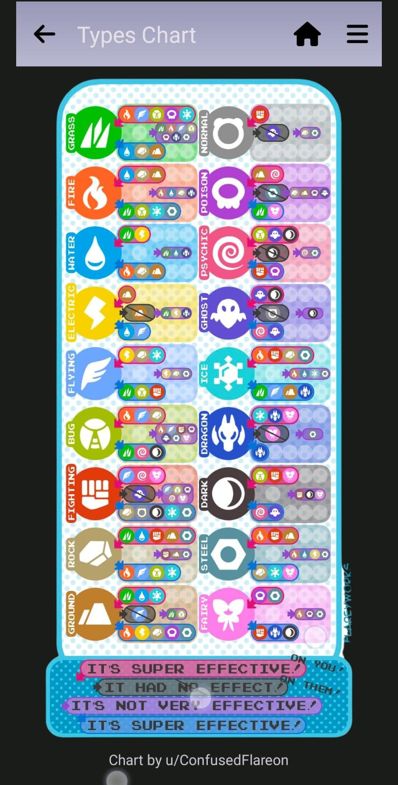

# Welcome to the Pokemon Center Project

This Android application allows users to browse and view information about Pokemon. It fetches data from the PokeAPI.

## Table of Contents
* [Features](#features)
* [App Preview](#app-preview)
* [Screenshots](#screenshots)
* [API Documentation](#api-documentation)
* [Build Environment](#build-environment)
* [Dependencies](#dependencies)
* [Usage](#usage)
* [Installation and Setup](#installation-and-setup)
* [TODO](#todo)
* [Contact](#contact)

## Features
* **Pokémon Search:** Easily find any Pokémon using the search bar.
* **Pokédex:** Browse Pokémon by region Pokédex.
* **Pokémon Details:**
    * View basic information (type, height, weight, etc.)
    * Check base stats.
    * Explore learnable moves.
* **Games List:** Explore details about main series games of each generation.
* **Natures Chart:** Understand the natures influence of each nature of the pokémon stats.
* **Types Chart:** Understand type effectiveness against other types
* **User-friendly Interface:** Designed for easy navigation and intuitive use.

**Note:** This project is currently under development. More features and content are being added!

## App Preview
* You can preview the app using the following link (opens in the current page)
* If you want to open it in a new tab use CTRL+click (on Windows and Linux) or CMD+click (on MacOS)
* [View Pokémon Center on Appetize.io](https://appetize.io/app/b_opjehbs46jcyxuacfdeoiig4fq)

## Screenshots
|  |  |  |  |  |  |
|:---:| :---: | :---: | :---: | :---: | :---: |


## API Documentation

**PokeAPI Data**

* **Base URL:** https://pokeapi.co/api/v2/
* **Endpoints Used:**
  <br>/pokemon/{id_or_name} (To get details of a specific Pokemon)
  <br>/pokemon (To get a list of Pokemon)
  <br>/pokemon-species/{id_or_name} (To get species details, including evolution chain) 
  <br>
* **Request Parameters:**
  <br>For `/pokemon` and `/pokemon-species`: `limit`, `offset` for pagination
  <br>
* **Response Format:**
  <br>JSON responses following the PokeAPI schema. Refer to the [PokeAPI documentation](https://pokeapi.co/docs/v2/) for detailed information about response structures.

## Build Environment
* **Kotlin:**  2.0.10
* **Target SDK:**  34
* **JVM Target:**  17

## Dependencies
* **Retrofit (2.11.0):**  For making network requests to the PokeAPI.
* **Gson (2.11.0):**  For parsing JSON data from the API.
* **Kotlin Coroutines:**  For managing asynchronous operations.
* **AndroidX ViewModel:**  For managing UI state and data.
* **Coil or Glide:** For image loading and caching. 
<br>

*for a detailed list of dependencies and their versions, please refer to [DEPENDENCIES.md](docs/DEPENDENCIES.md)*

## Usage

1. Launch the app.
2. Browse the list of Pokemon.
3. Tap on a Pokemon to view its detailed information.
4. Use the search bar to find specific Pokemon.

## Installation and Setup

1. **Clone the repository:**
   ```bash
   git clone https://github.com/iuryruansc/pokemon-center.git

3. **Open the project in your IDE:**
   <br>Android Studio is recommended.

4. **Run the application:**
   <br>Ensure your device or emulator is running Android 7.0 or higher.
   <br>Click the "Run" button in your IDE.

## TODO
* Improve UI/UX design.
* Add more detailed information to entries.
* Optimize performance.
* Write unit and instrumented tests.
* Implement search filtering by type, abilities, etc.
* Add support for displaying Pokemon evolution chains and regional variations.
  
## Contact
* **Maintainer:** Iury Ruan
* **Email:** iuryruansc@gmail.com
* Feel free to reach out if you have any questions, encounter any issues, or have suggestions for the project.

Feel free to reach out if you have any questions or suggestions!
